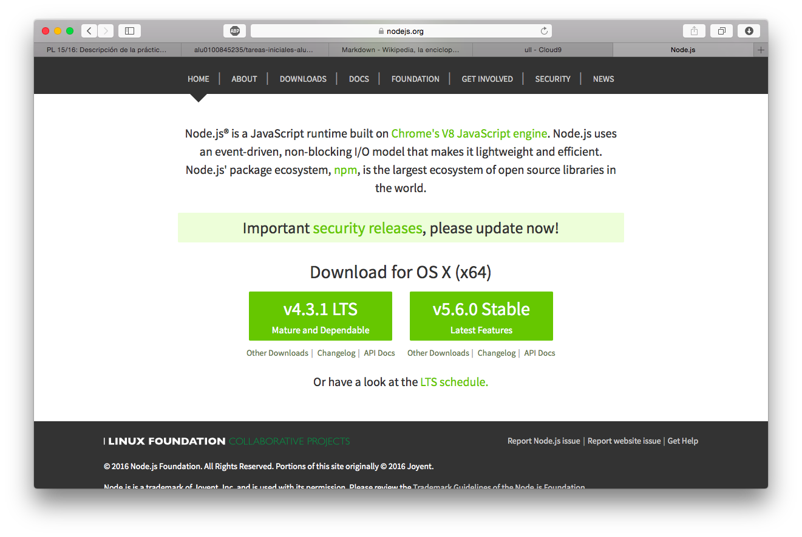
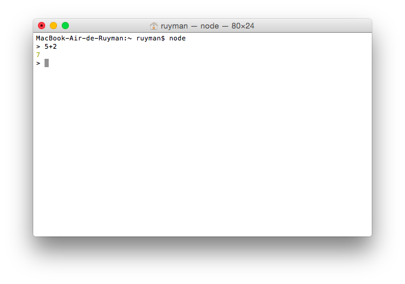
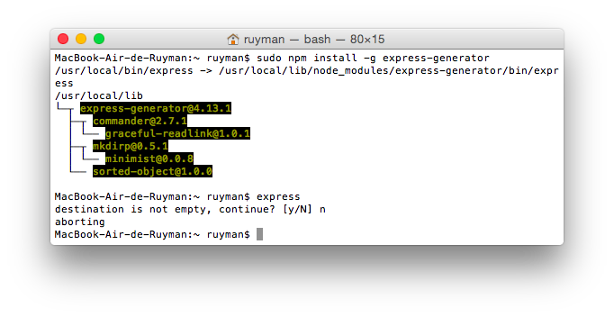
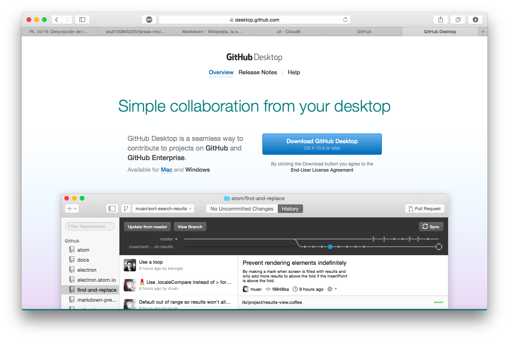
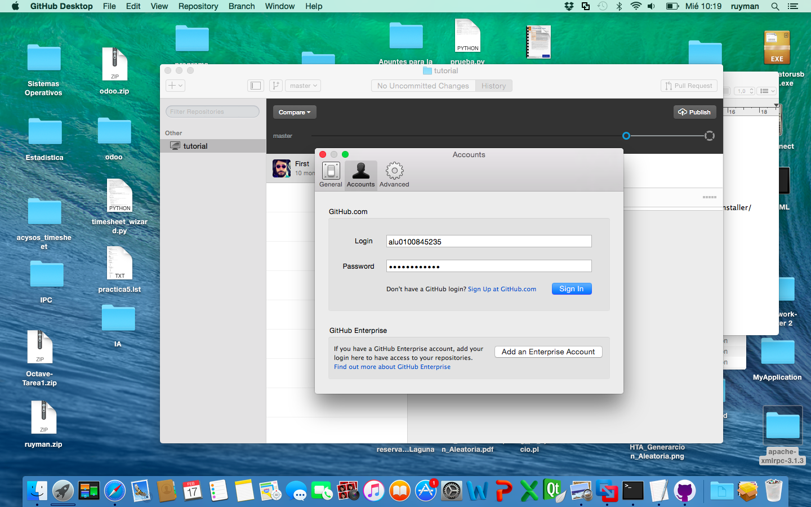
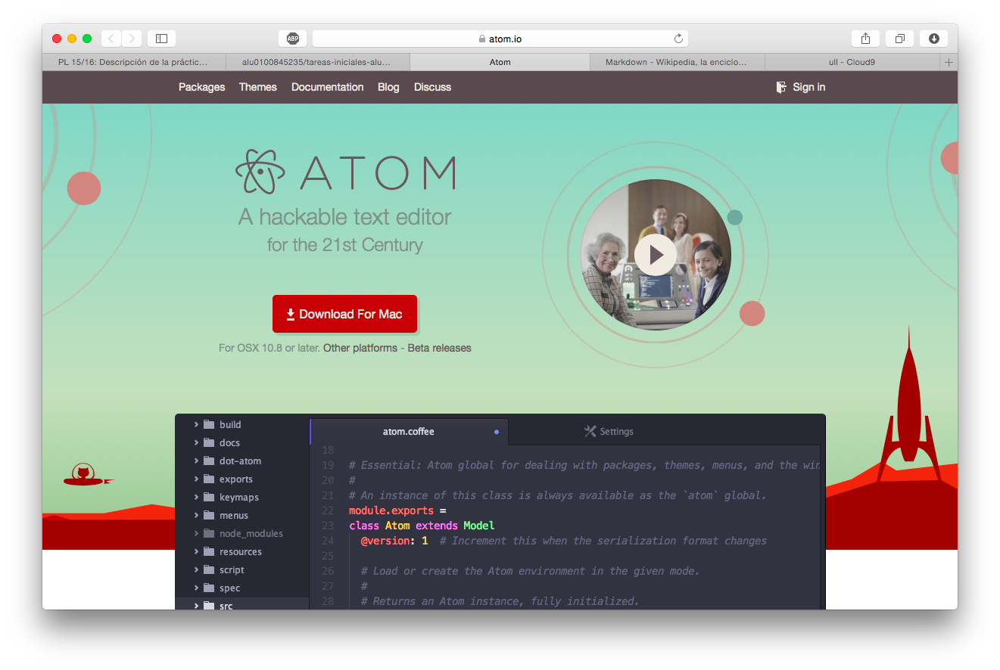
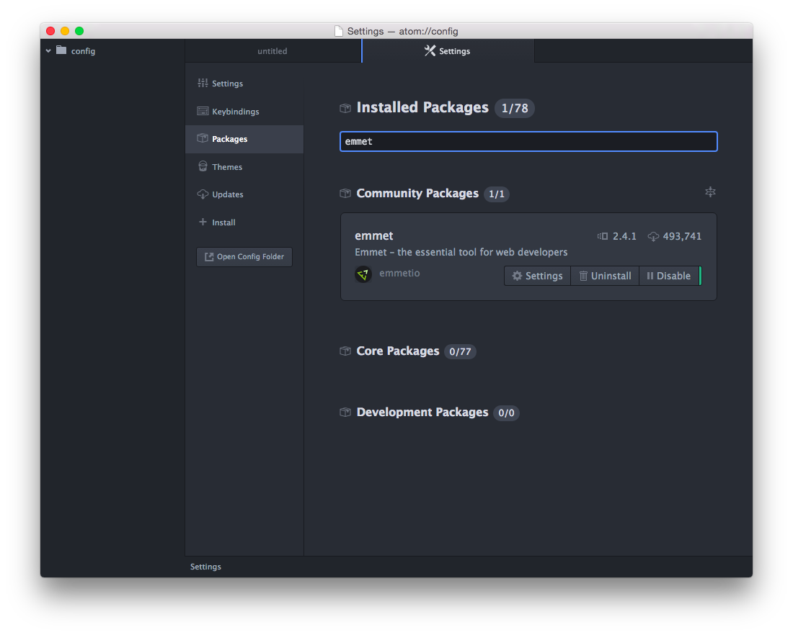
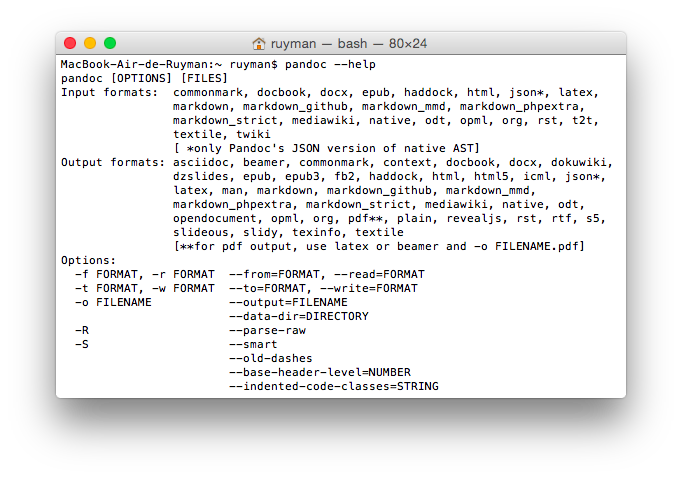
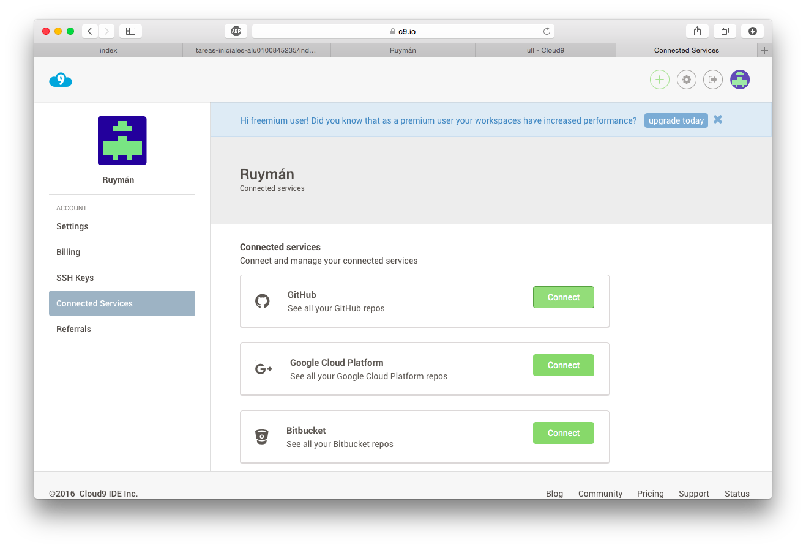
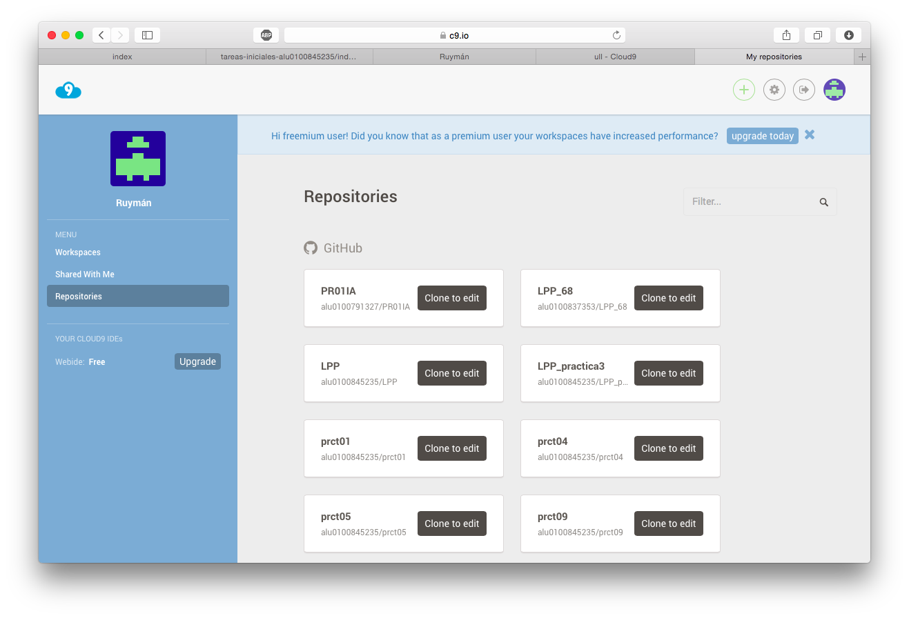

#Tutorial de instalación de NodeJS, Express, Atom, GitHub, Cloud9 y Markdown en MacOSX

## Instalación de NodeJS

1. Descargamos el instalador desde la web de [NodeJS](https://nodejs.org/en/)
2. Una vez descargado procedemos a las instalación.
3. Por último, abrimos un Terminal y escribimos node.

 

## Instalación de Express (Necesario tener NodeJS instalado)

1. Abrimos un Terminal y ejecutamos los siguientes comandos:
    * `sudo npm install -g express`
    * `sudo npm install -g express-generator`
2. Ahora comprobamos que este correctamente instalado ejecutando **Express**.



## Instalación de GitHub Desktop

1. Descargamos el instalador desde la web de [GitHub Desktop](https://desktop.github.com)
2. Opcionalmente, movemos el archivo descargado a la carpeta de Aplicaciones
3. Ejecutamos la aplicación y iniciamos sesión con nuestro usurio de GitHub.

 

## Instalación del editor de texto Atom

1. Descargamos el instalador desde la web de [Atom](https://atom.io)
2. Opcionalmente, movemos el archivo descargado a la carpeta de Aplicaciones
3. Ya podemos ejecutar la aplicación.



## Instalación del paquete Emmet para Atom

1. Abrimos Atom y navegamos por el menú Atom - Preferences - Packages
2. En el campo de busqueda que sale en la ventana derecha escribimos emmet
3. En el resultado, con el paquete de emmet hacemos click en instalar.



## Instalación del Pandoc

1. Descargamos el instalador desde la web de [Pandoc](http://pandoc.org)
2. Instalamos el paquete descargado.
3. Ejecutamos el siguiente comando en el terminal: **pandoc --help**



## Cloud9 - Vincular con GitHub

1. Navegamos hasta la web de [Cloud9](https://c9.io)
2. Iniciamos sesión con nuestra cuenta de usuario.
3. Vamos a las preferencias de la cuenta y seleccionamos el menú **Connected Services**
4. Nos solicitará el nombre de usuario y password de nuestra cuentas GitHub.
5. Ya tenemos los tenemos vinculas.
6. Ahora vamos a la pantalla principal de nuestra cuenta y seleccionamos Repositories.
7. Seleccionamos los repositorios que queremos clonar.

 

## Uso de Markdown (Sintaxis)

Encabezados
```
# Encabezado H1
## Encabezado H2
### Encabezado H3
```
Tipografía
```
**Negrita**
*Cursiva*
> Citas
Parrafo separar por lineas en blanco
`Codigo`
```
Recursos
```

* [Links](https://example.com)
```
Listas
```
1. Lista 1
2. Lista 2

* Lista 1
* Lista 2
```

**Enlaces de interés:**

* [NodeJS](https://nodejs.org)
* [Express](http://expressjs.com)
* [Atom IDE](https://atom.io)
* [GitHub Desktop](https://desktop.github.com)
* [GitHub](https://pages.github.com/)
* [Cloud 9](https://c9.io)
* [Markdown](http://daringfireball.net/projects/markdown/)
* [Pandoc](http://pandoc.org)